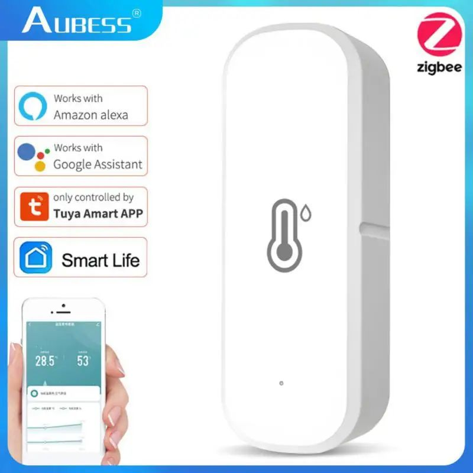
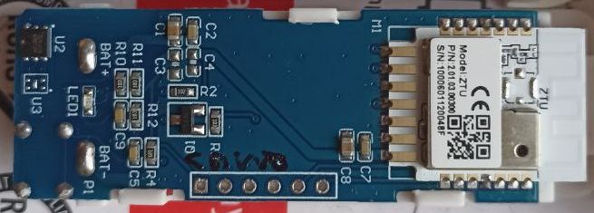
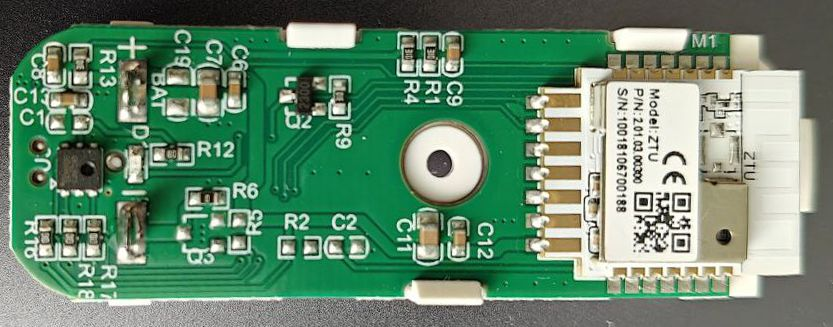
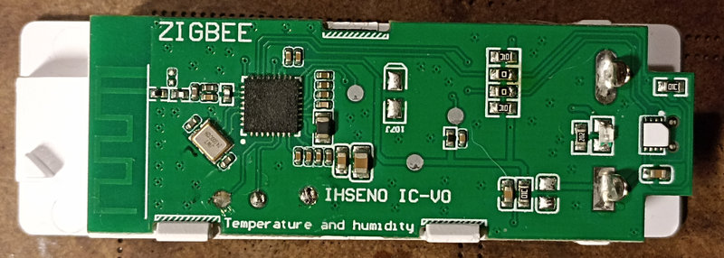
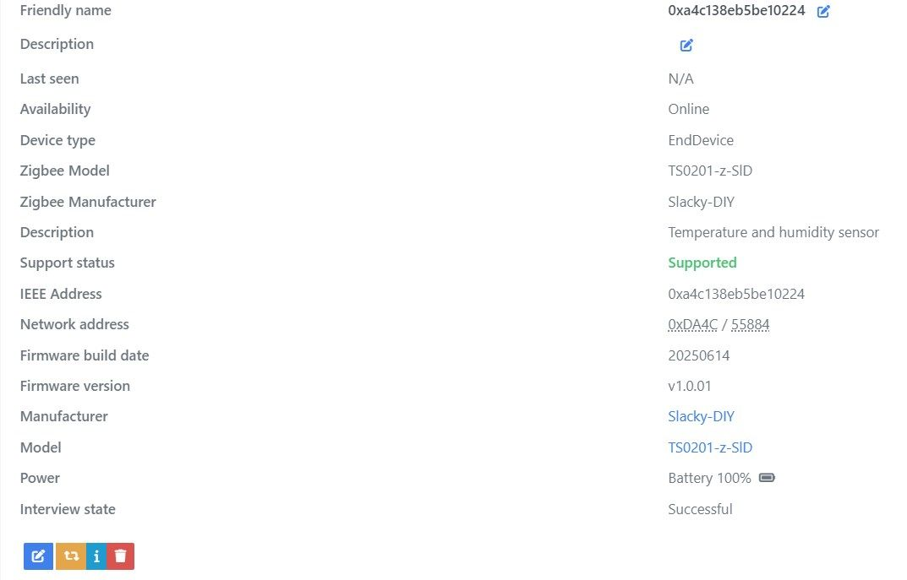
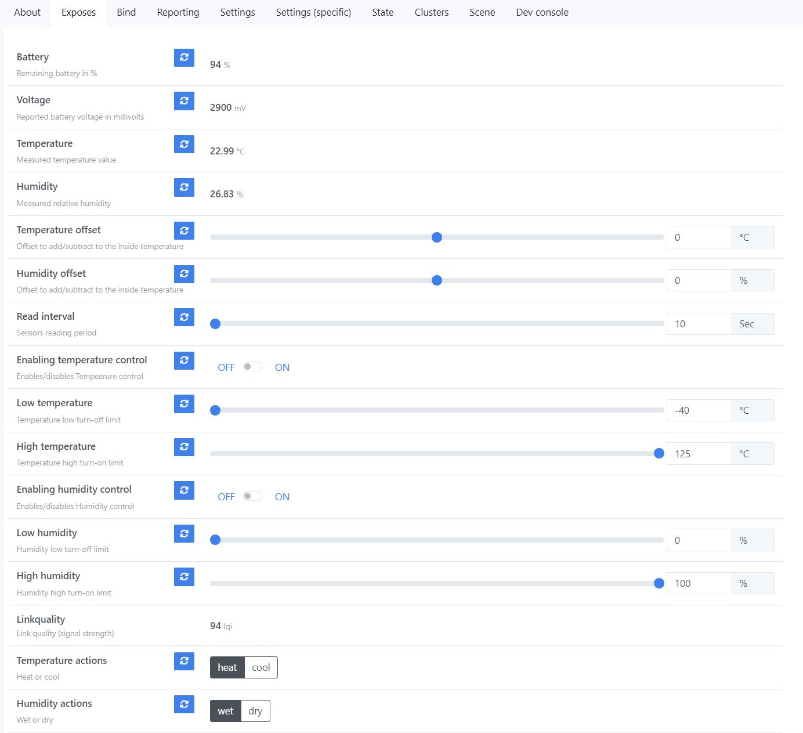
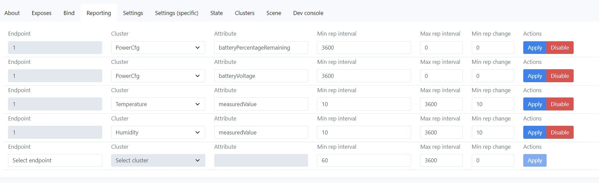
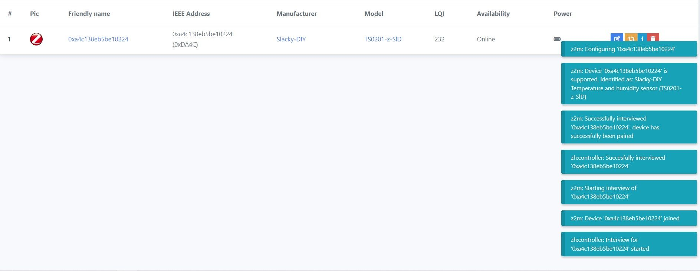

# <a id="Top">Tuya Temperature and Relative Humidity Sensor Zigbee with custom firmware</a>

### Custom firmware for Tuya sensor models

- _TZ3000_xr3htd96
- _TZ3000_fllyghyj
- _TZ3000_0s1izerx
- _TZ3000_dowj6gyi










**Автор не несет никакой отвественности, если вы, воспользовавшись этим проектом, превратите свой умный датчик в полоумный.**

Если у вас другая сигнатура, лучше не заливать, не проверив на совпадение сенсора и GPIO.

Проверялся только в zigbee2mqtt.

## Зачем. 

Понадобился датчик температуры и влажности, который умел бы отдавать свои значения не только координатору, а еще и напрямую другому устройству, например монитору с экраном. Ну а так, как прошивку все равно делать с нуля, то заодно сделать управление другим устройством через OnOff напрямую, например, при достижении определенной температуры, включить кондиционер, или, при достижении определенной влажности, включить вытяжку. Ну и выключить потом соответственно :))

Ну и еще. Оригинальная прошивка не умеет показывать температуру, ниже -20 градусов. А сам сенсор CHT8305 умеет до -40.

## Что получилось. 

**About**



**Exposes**



**Reporting**



## Как обновить.

Сначала подключаем к z2m один внешний [конвертор](zigbee2mqtt/ts0201_tz3000_orig.js). Он активирует OTA в z2m для датчика с прошивкой от Tuya.

Далее нужно добавить локальное хранилище обновлений. 

Создаем директорию `images` в директории z2m и кладем туда файл [1141-d3a3-1111114b-ts0201_tz3000_0x15_zed.zigbee](bin/1141-d3a3-1111114b-ts0201_tz3000_0x15_zed.zigbee) для - `_TZ3000_xr3htd96`, `_TZ3000_fllyghyj`, `_TZ3000_0s1izerx`. И копируем в директорию z2m файл [local_ota_index.json](zigbee2mqtt/_TZ3000_xr3htd96/local_ota_index.json)

Для `_TZ3000_dowj6gyi` кладем другой файл [1141-d3a3-1111114b-ts0201_tz3000_0x21_zed.zigbee](bin/1141-d3a3-1111114b-ts0201_tz3000_0x21_zed.zigbee) и копируем в директорию z2m файл [local_ota_index.json](zigbee2mqtt/_TZ3000_dowj6gyi/local_ota_index.json)

В конфиг z2m `configuration.yaml` добавляем локальное хранилище

```
ota:
  zigbee_ota_override_index_location: local_ota_index.json
```

А конвертор `ts0201_tz3000_orig.js` кладем в директорию `external_converters`, которую нужно создать в корне z2m.

Далее перегружаем z2m. И видим у нас новое устройство.


Далее идем в раздел OTA. И видим там свое устройство. Жмем проверить обновления.


	
Жмем на появившуюся красную кнопку. И обновляемся.

Если все не так, как описано, значит вы что-то сделали не по инструкции (не положили файл куда нужно, не перегрузили z2m) или сигнатуры вашего датчика нет в списке поддерживаемых устройств.

> [!WARNING]
> Внимание!!! Если в процессе вы обнаружите на каких-то устройствах Туя, которые возможно у вас есть еще в системе, новое обновление, то обновлять ничего не нужно!!! Иначе вы зальете в это устройство прошивку от датчика и получите кирпич!!! Если же процесс обновления по ошибке уже начался, то просто обесточьте это устройство!!!

Далее ждем окончания.

После обновления нужно удалить устройство из z2m. Разрешить сопряжение. Зажать кнопку на 5 секунд, пока светодиод не начнет моргать и отпустить. Начнется сопряжение.



Все, датчик готов к работе.

## Параметры устройства.

- **Battery** - емкость батарейки в %.
- **Voltage** - напряжение батарейки в mV.
- **Temperature** - диапозон от -40 до +125 °C.
- **Humidity** - диапазон от 0 до 100 %.
- **Temperature offset** - калибровка температуры от -5 до +5 °C с шагом 0,1.
- **Humidity offset** - калибровка влажности от -10 до + 10 % с шагом 1.
- **Read interval** - интервал чтения сенсора. От 5 до 600 секунд с шагом 1. Этому параметру стоит уделить отдельное внимание. Этот параметр также влияет на то время, которое модуль "спит", т.е. находится в режиме экономии батареи. По большому счету модуль "спит" весь этот период. По умолчанию этот период задан в 10 секунд. Модуль просыпается каждые 10 секунд, считывает данные из сенсора (температуру и влажность) и засыпает опять на 10 секунд. Выберете 20 секунд, будет "спать" по 20 секунд. Это нужно понимать и помнить, что перед каким-либо изменением параматров через сеть, нужно коротко нажать кнопку на датчике, чтобы он "проснулся". Также для более длительной работы от батарейки нужно учитывать настройку `MinIntrerval` для температуры и влажности в разделе `reporting`. По умолчанию там установлено тоже самое время, что и интервал чтения сенсора. Сон датчика так же зависит еще и от этого параметра. Поэтому, если интервал чтения сенсора менять в большую сторону, то и `MinInterval` тоже нужно привести к этому значению.
- **Enabling temperature control** - активирование управления первым удаленным устройством по температуре.
- **High temperature** - высокая граница температуры - при переходе этой границы в большую сторону будет послана команда на включение удаленного устройства.
- **Low temperature** - низкая граница температуры - при переходе этой границы в меньшую сторону будет послана команда на выключение удаленного устройства.
- **Enabling humidity control** - активирование управления вторым удаленным устройством по влажности.
- **High humidity** - высокая граница влажности - при переходе этой границы в большу сторону будет послана команда на включение удаленного устройства.
- **Low humidity** - низкая граница влажности - при переходе этой границы в меньшую сторону будет послана команда на выключение удаленного устройства.
- **Temperature actions** - настраивает, какую именно команду мы шлем при управлении удаленным устройством по температуре. Если этот параметр установлен в `heat`, то при увеличении и достижении `High temperature` температуры высылается колманда `off`, а при уменьшении и достижении `Low temperature` температуры высылается команда `on`. Таким образом мы получаем режим работы нагревателя. Если же параметр `Temperature actions` установлен в `cool`, то команды меняются местами. Таким образом мы получаем режим работы охладителя.
- **Humidity actions** - настраивает, какую именно команду мы шлем при управлении удаленным устройством по влажносте. Если этот параметр установлен в `wet`, то при увеличении и достижении `High humidity` влажности высылается колманда `off`, а при уменьшении и достижении `Low humidity` влажности высылается команда `on`. Таким образом мы получаем режим работы осушителя. Если же параметр `Humidity actions` установлен в `dry`, то команды меняются местами. Таким образом мы получаем режим работы увлажнителя.


## Немного про настройку прямого биндинга для управления каким-либо устройством.

Для управление внешним устройством напрямую нужно сперва настроить биндинг. Это делается во вкладке `Bind` z2m. Выбираем Эндпоинт 1 для температуры, затем выбираем устройство, которым хотим управлять, отмечаем кластер `OnOff`. Затем нажимаем кнопку на самом датчике, чтобы его разбудить и после жмем `Bind` в интерфейсе z2m. Система оповестит об успешном соединении или об ошибке.

Далее выбираем Эндпоинт 2 для влажности и повторяем процедуру.


Датчик можно настроить на управление одним или несколькими внешними устройствами только от температуры, только от влажности или от обоих значений одновременно. Управление внешними устройствами можно настроить, как отдельно каждым, например по температуре управляет одно устройство, а по влажности другое. Так и совместить управление от двух параметров одним устройством. Так же можно настроить управление от одного канала, например по температуре, несколькими устройствами.

## Потребление

При настройке по умолчанию `Read interval` 10 секунд двух батареек ААА должно хватить минимум на 2 года.


При настройке `Read interval` 60 секунд двух батареек ААА должно хватить лет на 8 (не забываем менять `MinInterval` в отчетах температуры и влажности на такое же значение).


Связаться со мной можно в **[Telegram](https://t.me/slacky1965)**.

### Если захотите отблагодарить автора, то это можно сделать через [ЮMoney](https://yoomoney.ru/to/4100118300223495)

P.S. Датчик покупался по ссылке вот из этого [проекта](https://pvvx.github.io/TS0201_TZ3000/) в октябре 2024, но сейчас продавец в Россию не отправляет. И спасибо [Виктору](https://pvvx.github.io/) за предоставленную информацию по этому датчику. Второй датчик покупался [вот тут](https://aliexpress.ru/item/1005007755890938.html?sku_id=12000042104302703) (за это отдельное спасибо [Олегу](https://t.me/Novgorod_DIYZi)).

## История версий
- 1.0.01
	- Начало.
- 1.0.02
	- Выявлены и устранены баги с передачей влажности и высокой температуры.
- 1.0.03
	- Откорректирована принудительная передача репортов при нажатии на кнопку.
	- Устранены баги с отчетами (SDK не идеальна).
	- Добавлены в `Output Cluster List` кластеры температуры, влажности и батарейки.
- 1.0.04
	- Добавлены репорты ВСЕХ значений по нажатию кнопки.
	- Изменена структура прошивки, теперь не нужно обновлять оригинальное устройство два раза.
	- Добавлены раздельные каналы управления сторонними устройствами. Отдельно по температуре, отдельно по влажности.
	- Добавлено повторение команды на сторонние устройства, если температура или влажность не изменяются.
- 1.0.05
	- Добавлена дополнительная проверка при включении контроля по температуре и(или) влажности. И команда `On` или `Off` отправляется сразу, в зависимости от значения этих параметров.
- 1.0.06
	- Добавлен датчик `_TZ3000_dowj6gyi`
	
[Наверх](#Top)


