# <a id="Top">Tuya Temperature and Relative Humidity Sensor Zigbee with custom firmware</a>

Альтернативные версии на различные датчики `Zigbee` можно еще посмотреть у [pvvx](https://github.com/pvvx/ZigbeeTLc).

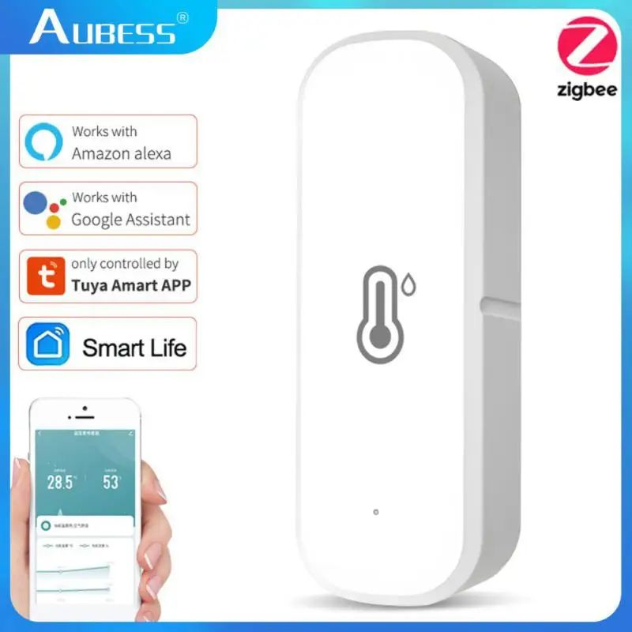

### Custom firmware for Tuya sensor models

- TS0201 _TZ3000_xr3htd96
- TS0201 _TZ3000_fllyghyj
- TS0201 _TZ3000_0s1izerx

Прошивка для этих датчиков имеет в имени число 0x15

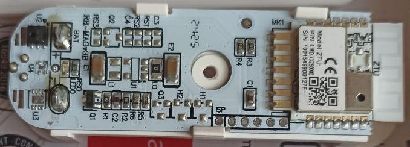

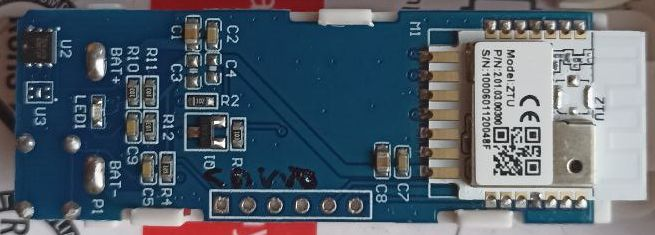

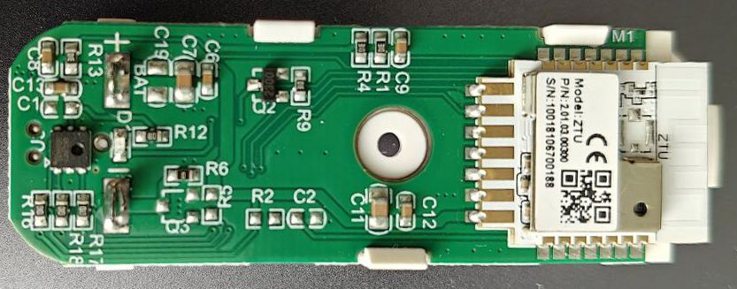

- TS0201 _TZ3000_dowj6gyi

Прошивка для этих датчиков имеет в имени число 0x21

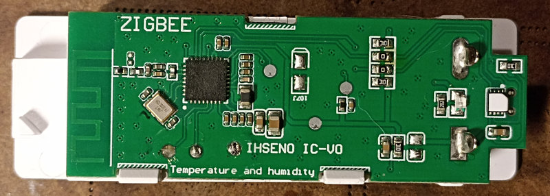

- TS0201 Zbeacon

Прошивка для этих датчиков имеет в имени число 0x22

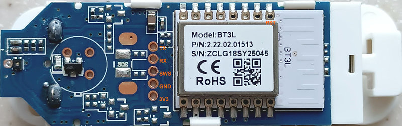

- ZG-227Z HOBEIAN

Прошивка для этих датчиков имеет в имени число 0x23

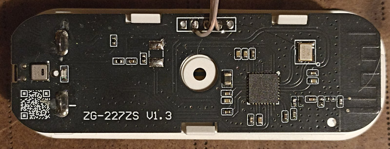

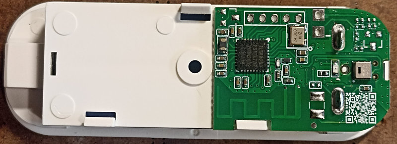

- TH01 Zbeacon

Прошивка для этих датчиков имеет в имени число 0x24

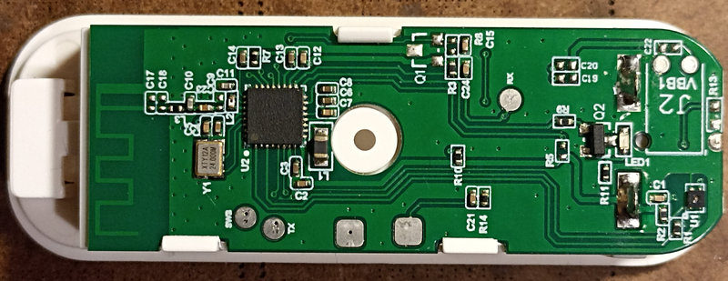

- Z-WXD _TZ3000_stw9kdvl

Прошивка для этих датчиков имеет в имени число 0x28

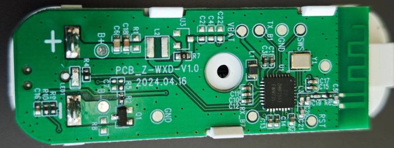

**Автор не несет никакой ответственности, если вы, воспользовавшись этим проектом, превратите свой умный датчик в полоумный.**

Если у вас другая сигнатура, лучше не заливать, не проверив на совпадение сенсора и GPIO.

Проверялся в zigbee2mqtt и HomEd.

## Зачем. 

Понадобился датчик температуры и влажности, который умел бы отдавать свои значения не только координатору, а еще и напрямую другому устройству, например монитору с экраном. Ну а так, как прошивку все равно делать с нуля, то заодно сделать управление другим устройством через OnOff напрямую, например, при достижении определенной температуры, включить кондиционер, или, при достижении определенной влажности, включить вытяжку. Ну и выключить потом соответственно :))

Ну и еще. Оригинальная прошивка не умеет показывать температуру, ниже -20 градусов. А сам сенсор CHT8305 умеет до -40.

А потом в зоне внимания стали появляться другие датчики и проект несколько раздулся :))

## Что получилось. 

**About**

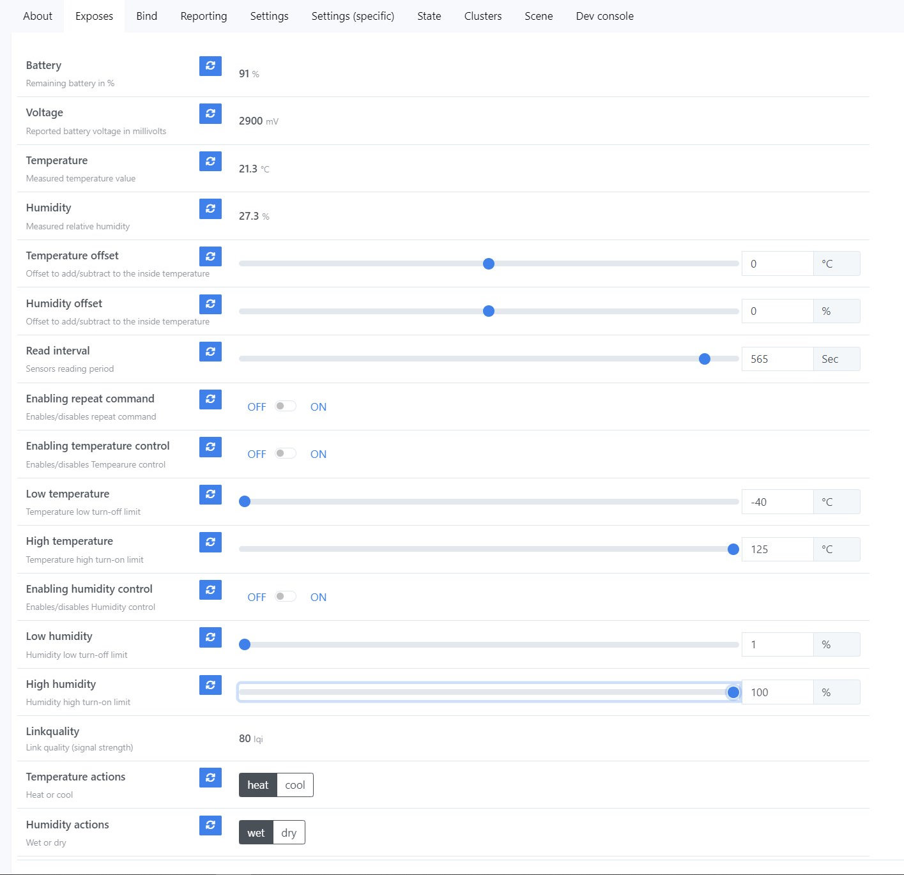

**Exposes**

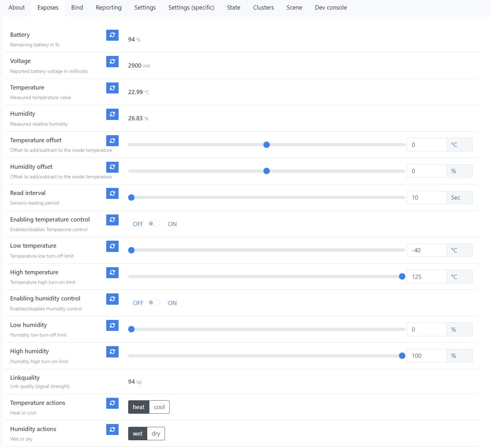

**Reporting**

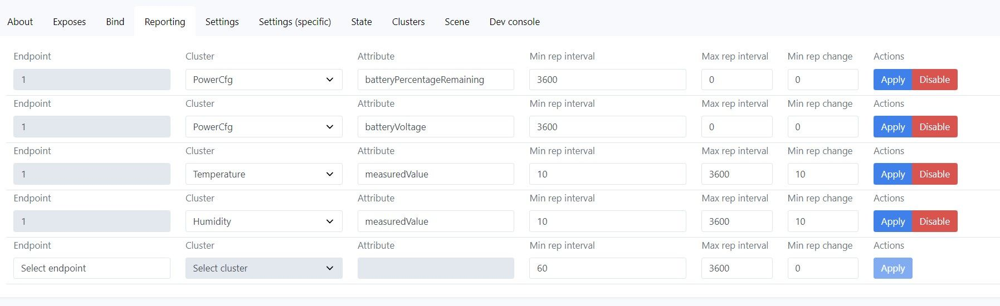

## Как обновить. 

    
Раскрыть

 

<a>В таблице приведены файлы и метод обновления для каждого датчика</a>

| Custom Zigbee Model | Original Zigbee Model | Z2M Model | Original Zigbee Manufacturer | Update method |
|:-------------------:|:---------------------:|:---------:|:----------------------------:|:-------------:|
| TS0201-z-SlD TS0201-z15-SlD | TS0201 | [WSD500A](https://www.zigbee2mqtt.io/devices/WSD500A.html) | _TZ3000_xr3htd96 _TZ3000_fllyghyj _TZ3000_0s1izerx | [OTA file](https://github.com/slacky1965/ts0201_tz3000_zed/raw/refs/heads/main/bin/1141-d3a3-1111114b-ts0201_tz3000_0x15_zed.zigbee) |
| TS0201-z21-SlD     | TS0201 | [IH-K009](https://www.zigbee2mqtt.io/devices/IH-K009.html) | _TZ3000_dowj6gyi | [OTA file](https://github.com/slacky1965/ts0201_tz3000_zed/raw/refs/heads/main/bin/1141-d3a3-1111114b-ts0201_tz3000_0x21_zed.zigbee) |
| TS0201-z22-SlD     | TS0201 | [ZY-ZTH02](https://www.zigbee2mqtt.io/devices/ZY-ZTH02.html) | Zbeacon | [OTA file](https://github.com/slacky1965/ts0201_tz3000_zed/raw/refs/heads/main/bin/1286-0202-1111114b-ts0201_tz3000_0x22_zed.zigbee) |
| TS0201-z23-SlD     | TS0201 | [ZG-227Z](https://www.zigbee2mqtt.io/devices/ZG-227Z.html) | HOBEIAN | [BIN file](https://github.com/slacky1965/ts0201_tz3000_zed/raw/refs/heads/main/bin/ts0201_tz3000_0x23_zed_last_version.bin) |
| TS0201-z24-SlD     | TH01 | [TH01](https://www.zigbee2mqtt.io/devices/TH01.html) | Zbeacon | [OTA file](https://github.com/slacky1965/ts0201_tz3000_zed/raw/refs/heads/main/bin/1286-0202-1111114b-ts0201_tz3000_0x24_zed.zigbee) |
| TS0201-z28-SlD     | TS0201 | [TS0201](https://www.zigbee2mqtt.io/devices/TS0201.html#tuya-ts0201) | _TZ3000_stw9kdvl | [OTA file](https://github.com/slacky1965/ts0201_tz3000_zed/raw/refs/heads/main/bin/1141-d3a3-1111114b-ts0201_tz3000_0x28_zed.zigbee) |

### Для датчиков, поддерживающих обновление OTA

`zigbee2mqtt` нужно переключиться в новый интерфейс - `zigbee2mqtt-windfront`.

Итак, скачиваем из репозитория нужный файл обновления (какой именно смотрите в таблице вверху). Заходим в устройство. И справа видим в `Firmware version` значок облака. Нам сюда.

Далее выбираем `Custom firmware` из вываливающегося списка.

После этого выбираем файл.

Далее нажимаем кнопку на датчике, т.е. будим его и жмем обновить.

Чтобы понять, пошло обновление или нет, возвращаемся в пункт `Devices` и смотрим на изображение датчика, там должен появиться вращающийся кружок со стрелками.

Ну и еще это все будет фиксироваться в логе.

После завершения обновления датчик готов к спариванию, нужно только разрешить это в `zigbee2mqtt`. Старую версию датчика просто удаляем. 

### Для датчиков, не поддерживающих обновление OTA

Как залить прошивку можно почитать [тут](https://github.com/pvvx/ATC_MiThermometer?tab=readme-ov-file#the-usb-com-adapter-writes-the-firmware-in-explorer-web-version). 
 
Зайдите на страницу [USBCOMFlashTx.html](https://pvvx.github.io/ATC_MiThermometer/USBCOMFlashTx.html). Назначьте порт - `Open`. Нажмите на кнопку на датчике, светодиод должен моргнуть. Далее нажмите `Erase All Flash`. Когда в логе отразится, что очистка завершена, снова нажмите на кнопку. Светодиод не должен моргать. Если он моргнет, значит вы ничего не стерли - проверьте подключение. Если не моргает, значит все хорошо. Выберите файл, например `ts0201_tz3000_0x23_zed_last_version.bin` для датчика с номером `23`. И нажмите `Write to Flash`. 

   

   
## Параметры устройства.

- **Battery** - емкость батарейки в %.
- **Voltage** - напряжение батарейки в mV.
- **Temperature** - диапозон от -40 до +125 °C.
- **Humidity** - диапазон от 0 до 100 %.
- **Temperature offset** - калибровка температуры от -5 до +5 °C с шагом 0,1.
- **Humidity offset** - калибровка влажности от -10 до + 10 % с шагом 1.
- **Read interval** - интервал чтения сенсора. От 5 до 600 секунд с шагом 1. По умолчанию этот период задан в 10 секунд. Используется, если репортинг температуры или влажности установлен более 600 секунд. Эти параметры также влияют на то время, которое модуль "спит", т.е. находится в режиме экономии батареи. Время считывания сенсора берется из настроек репортинга, если он не превышает 600 секунд. Если превышает, то из `Read interval`.
- **Enabling repeat command** - активирование повторения команд при активации `Enabling temperature control` и (или) `Enabling humidity control`.
- **Enabling temperature control** - активирование управления удаленным устройством по температуре.
- **High temperature** - высокая граница температуры - при переходе этой границы в большую сторону будет послана команда на включение удаленного устройства.
- **Low temperature** - низкая граница температуры - при переходе этой границы в меньшую сторону будет послана команда на выключение удаленного устройства.
- **Enabling humidity control** - активирование управления удаленным устройством по влажности.
- **High humidity** - высокая граница влажности - при переходе этой границы в большую сторону будет послана команда на включение удаленного устройства.
- **Low humidity** - низкая граница влажности - при переходе этой границы в меньшую сторону будет послана команда на выключение удаленного устройства.
- **Temperature actions** - настраивает, какую именно команду мы шлем при управлении удаленным устройством по температуре. Если этот параметр установлен в `heat`, то при увеличении и достижении `High temperature` температуры высылается команда `off`, а при уменьшении и достижении `Low temperature` температуры высылается команда `on`. Таким образом мы получаем режим работы нагревателя. Если же параметр `Temperature actions` установлен в `cool`, то команды меняются местами. Таким образом мы получаем режим работы охладителя.
- **Humidity actions** - настраивает, какую именно команду мы шлем при управлении удаленным устройством по влажности. Если этот параметр установлен в `wet`, то при увеличении и достижении `High humidity` влажности высылается команда `off`, а при уменьшении и достижении `Low humidity` влажности высылается команда `on`. Таким образом мы получаем режим работы осушителя. Если же параметр `Humidity actions` установлен в `dry`, то команды меняются местами. Таким образом мы получаем режим работы увлажнителя.

## Немного про настройку прямого биндинга для управления каким-либо устройством.

Для управление внешним устройством напрямую нужно сперва настроить биндинг. Это делается во вкладке `Bind` в `zigbee2mqtt`. Выбираем Эндпоинт 1 для температуры, затем выбираем устройство, которым хотим управлять, отмечаем кластер `OnOff`. Затем нажимаем кнопку на самом датчике, чтобы его разбудить и после жмем `Bind` в интерфейсе `zigbee2mqtt`. Система оповестит об успешном соединении или об ошибке.

Далее выбираем Эндпоинт 2 для влажности и повторяем процедуру.

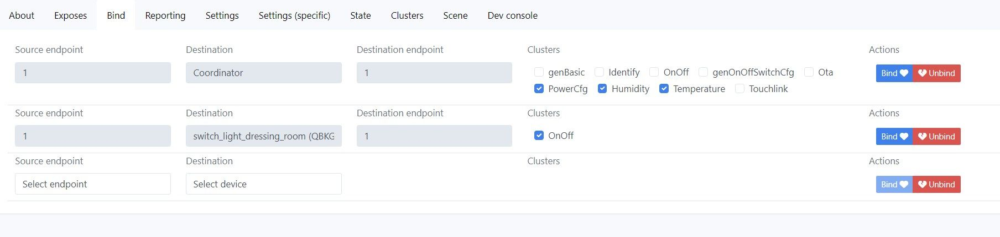

Датчик можно настроить на управление одним или несколькими внешними устройствами только от температуры, только от влажности или от обоих значений одновременно. Управление внешними устройствами можно настроить, как отдельно каждым, например по температуре управляет одно устройство, а по влажности другое. Так и совместить управление от двух параметров одним устройством. Так же можно настроить управление от одного канала, например по температуре, несколькими устройствами.

> [!WARNING]
> Внимание!!! Если биндинг настроен на группы. Если температура и влажность забинжены на разные группы, но в этих группах есть одно и тоже устройство, могут быть сюрпризы по зацикливанию включения и выключения! В этом случае рекомендуется не включать повтор команд `Enabling repeat command`.

## Потребление

При настройке по умолчанию `Read interval` 10 секунд двух батареек ААА должно хватить минимум на 2 года.

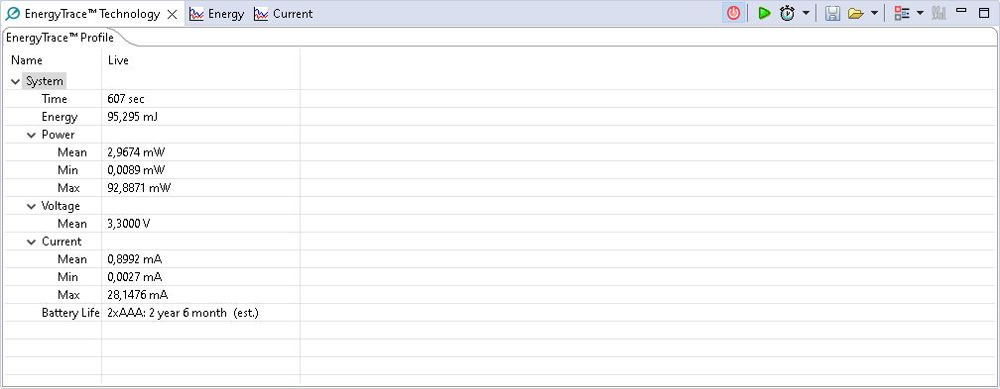

При настройке `Read interval` 60 секунд двух батареек ААА должно хватить лет на 8 (не забываем менять `MinInterval` в отчетах температуры и влажности на такое же значение).

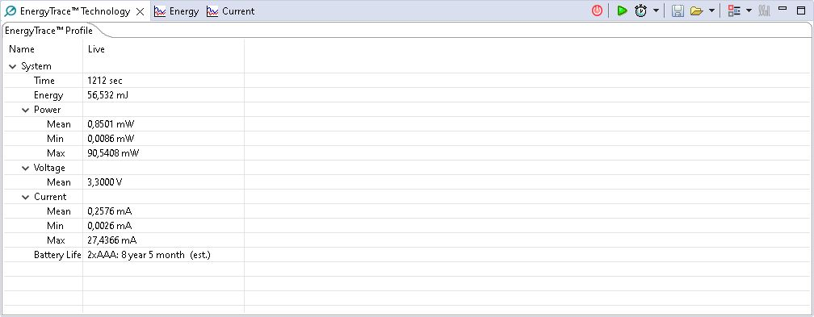

Связаться со мной можно в **[Telegram](https://t.me/slacky1965)**.

### Если захотите отблагодарить автора, то это можно сделать через [ЮMoney](https://yoomoney.ru/to/4100118300223495)

P.S. Датчик покупался по ссылке вот из этого [проекта](https://pvvx.github.io/TS0201_TZ3000/) в октябре 2024, но сейчас продавец в Россию не отправляет. И спасибо [Виктору](https://pvvx.github.io/) за предоставленную информацию по этому датчику. Второй датчик покупался [вот тут](https://aliexpress.ru/item/1005007755890938.html?sku_id=12000042104302703) (за это отдельное спасибо [Олегу](https://t.me/Novgorod_DIYZi)).

## История версий
- 1.0.01
	- Начало.
- 1.0.02
	- Выявлены и устранены баги с передачей влажности и высокой температуры.
- 1.0.03
	- Откорректирована принудительная передача репортов при нажатии на кнопку.
	- Устранены баги с отчетами (SDK не идеальна).
	- Добавлены в `Output Cluster List` кластеры температуры, влажности и батарейки.
- 1.0.04
	- Добавлены репорты ВСЕХ значений по нажатию кнопки.
	- Изменена структура прошивки, теперь не нужно обновлять оригинальное устройство два раза.
	- Добавлены раздельные каналы управления сторонними устройствами. Отдельно по температуре, отдельно по влажности.
	- Добавлено повторение команды на сторонние устройства, если температура или влажность не изменяются.
- 1.0.05
	- Добавлена дополнительная проверка при включении контроля по температуре и(или) влажности. И команда `On` или `Off` отправляется сразу, в зависимости от значения этих параметров.
- 1.0.06
	- Добавлен датчик `TS0201 _TZ3000_dowj6gyi`.
	- Включен `watch dog`.
- 1.0.07
	- Добавлен датчик `TS0201 Zbeacon`.
	- Добавлен датчик `ZG-227Z HOBEIAN`.
- 1.0.08
	- Добавлена проверка биндинга. Сделано для правильной работы команд `OnOff`, когда оба параметра (и влажность, и температура), забинжены на одно исполнительное устройство.
	- Добавлена возможность включать и отключать повтор команд.
	- Изменен выбор периода чтения сенсора.
	- Добавлен датчик `TH01 Zbeacon`.
- 1.0.09
	- Добавлен датчик `TS0201 _TZ3000_stw9kdvl` - [#20](https://github.com/slacky1965/ts0201_tz3000_zed/pull/20).
	- Изменен период проверки обновлений на 6 часов.
- 1.0.10
	- Проверен датчик `ZG-227Z HOBEIAN в другом исполнении.
	- Исправлены константы проверки диапазона влажности для OnOff, когда ее из сети задают.
	- Исправлены типы переменных для температуры.
	- Исправлена проверка на запущенный таймер findbindTimerEvt.
	
[Наверх](#Top)

